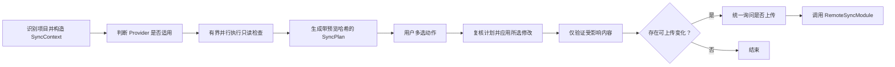

# 阶段 04：重构 Sync 为本地维护流程

## 目标

`harness-sync` 只负责本地 Harness 资料的检查、选择性优化和局部复查。它不是 Change 生命周期阶段，不上传监控事件，不维护知识库，也不自行实现远端上传。

## 依赖与并行边界

本阶段拆为两个可独立验收的工作包：

- **04A 计划与动作框架**：依赖阶段 01 和阶段 02 的 Interface。实现只读检查、动作注册、选择性应用和局部复查，可与阶段 05～08 并行。
- **04B 能力接入**：等待阶段 05 的 Map Interface 和阶段 07 的 `inspect()`/`propose()` Interface 冻结，再接入对应动作。

阶段 04 拥有 Sync 编排和 `SyncActionProvider` Seam，不拥有 Codebase Map、规则治理、CodeGraph 或 Push 的 Implementation。阶段 05 和阶段 07 分别提供 Adapter，双方不得直接修改 Sync 主流程。

## 当前实现基线与偏差

当前实现已经满足两项基本边界：Sync 不追加 Change 事件，也不上传运行监控；指令图只检查当前启用 Agent 的入口。以下行为仍与本阶段目标不一致。实施 04A 前，先用回归夹具记录这些行为，再逐项替换旧契约：

- 普通 `sync` 会直接调用 Adapter 刷新；用户未选择修复动作时也可能改写受管文件、安装状态和项目配置。
- `--apply safe` 只校验参数值，没有按风险筛选和执行动作；`--fix` 只能执行 Adapter 刷新，不能应用其他已报告的修复项。
- Sync 先选择一个项目 Profile，再把它传给所有 Agent。已安装 Agent 使用不同 Profile 时，刷新可能覆盖原有选择。
- 组件收据中的 `inputHash`、`outputHash`、`evidence` 和 `autoFixed` 仍是占位值。版本信息在写入前读取，应用动作后的摘要可能继续展示旧版本。
- 项目识别之前会先探测 Python。即使本次只需执行 TypeScript 检查，Python 不可用也会阻塞整个 Sync。
- 所有组件按固定顺序执行；Change 状态、CodeGraph 和其他不适用检查不会跳过。单个 Python 子进程还会继承通用长任务预算。
- `knowledge` 组件只返回固定的远端职责声明；`rules` 组件每次固定提示审计。两者都没有提供本次输入是否变化的有效证据。
- Codebase Map 主要按生成时间判断过期；CodeGraph 权威状态接口不可用时会递归扫描项目，无法证明删除文件已经进入索引。
- 旧 `harness_sync.py` 只剩兼容测试和打包内容，没有生产调用方；Sync 主文件中还保留另一套未被主流程使用的 CodeGraph 探测函数。

这些偏差不应通过在现有顺序流程中继续增加条件分支修复。阶段 04 应先建立稳定的 Provider Interface，再迁移现有检查和动作。

## 建议接口

```text
inspect(context, providerIds?) -> SyncPlan
apply(planId, previewHash, actionIds, confirmation) -> SyncApplyResult
verify(receipts) -> SyncVerification[]
```

`SyncContext` 保存本次运行共享且不可变的项目证据：项目身份、仓库与 worktree 身份、当前提交、upstream、dirty/untracked 变化、已启用 Agent、每个 Agent 的 Profile、平台绑定状态和功能开关。Provider 不得分别推断这些身份。

`SyncPlan` 包含 `schema_version`、计划身份、输入哈希、检查结果、可执行动作、预计写入范围、风险、预计耗时和预览哈希。`SyncApplyResult` 包含实际修改、验证结果、回滚信息和可上传范围。应用时任一输入、目标文件或远端基线发生变化，必须返回计划已过期，不得继续使用旧确认。

`SyncPlan` 是短期操作状态，不是运行日志或 Change 事件。交互式同进程执行可以只保存在内存；需要跨进程应用时，写入被忽略的 `.harness/state/local/sync-plans/<plan_id>.json`，并记录 `created_at`、`expires_at`、`input_hash`、`preview_hash` 和创建者身份。过期、输入变化或成功应用后不得重放旧计划；清理计划文件不影响 canonical 内容。

```text
SyncContext = {
  schema_version,
  project_identity,
  repository_identity?,
  worktree_identity?,
  current_commit?,
  upstream_ref?,
  project_change_set,
  enabled_agents[],
  agent_profiles,
  platform_binding?,
  feature_flags,
  context_hash
}

SyncPlan = {
  schema_version,
  plan_id,
  context_hash,
  input_hash,
  findings[],
  actions[],
  expected_writes[],
  preview_hash,
  created_at,
  expires_at
}
```

计划中的动作使用显式依赖图：

```text
SyncAction = {
  action_id,
  provider_id,
  depends_on[],
  conflicts_with[],
  invalidates_providers[],
  expected_writes[],
  risk,
  rollback_strategy,
  invalidation_hash
}
```

Sync 按拓扑顺序执行所选动作；缺失依赖、冲突动作同时入选或出现依赖环时，计划无效。应用后只复查 `invalidates_providers` 和实际修改路径对应的 Provider。

动作 Adapter 使用统一 Interface：

```text
applicable(context) -> ProviderApplicability
inspect(context) -> SyncFinding[]
plan(findingIds) -> SyncActionPlan
apply(actionPlan, confirmation) -> SyncActionReceipt
verify(receipt) -> SyncVerification
```

`SyncActionPlan` 必须声明预计写入路径、是否访问网络、是否调用模型、风险、回滚方式和失效哈希。Sync 根据这些字段决定是否需要确认和复查，不能识别 Adapter 的内部实现。

### 适用性、健康状态和动作紧迫度

不要用一个状态同时表达「功能未配置」「检查失败」和「建议执行动作」。每个 Provider 分别返回：

- `applicability`：`applicable`、`not_applicable` 或 `unavailable`。
- `status`：兼容现有 `OK`、`ADVISORY`、`WARN`、`FAIL`、`BLOCKED` 和 `UNKNOWN`。
- `urgency`：`none`、`optional`、`recommended` 或 `required`。

未启用 CodeGraph、没有活动 Change、项目未采用 Codebase Map 等情况使用 `not_applicable`，不提高全局警告级别。证据不足使用 `UNKNOWN`，不能写成已经通过。面向用户的标题和说明使用中文；稳定原因码保留在结构化技术详情中。

紧凑摘要必须包含 `schema_version`，并准确统计全部状态和不适用 Provider。`BLOCKED` 不能在修复列表中降级成 `WARN`。`reportPath` 和 `reportSha256` 在兼容期保留为 `null` 并标记弃用；新调用方不得依赖这两个占位字段。

### 收据真实性

每个组件收据至少记录：

- 实际输入哈希、输出哈希和证据来源。
- 是否发生写入、实际修改路径和回滚信息。
- 写入后的版本、内容哈希和验证结果。
- Provider 耗时、超时类型和降级原因。

没有实际修复时，`autoFixed` 为 `false`；应用动作并验证成功后才可标记为 `true`。写入前读取的版本不能作为写入后结果。

## 执行流程



交互式 Skill 使用固定复选框形式。非交互 CLI 只输出结构化计划，必须显式指定动作和确认参数后才能写入文件。

## 保留的检查

- CLI、工作流包和已安装 Agent 投影的版本与内容差异。
- 当前已启用 Agent 的指令入口和引用完整性。
- 配置真源与生成投影差异。
- 规则和指令是否需要重新审计。
- Codebase Map 的完整性、来源提交和受影响范围。
- 仅在项目已经启用 CodeGraph 时检查索引和后台增量同步。
- 仅在存在活动 Change 或修复动作会影响 Change 时检查 Change 状态。

### 组件适用条件

| Provider | 适用条件 | 不适用时的结果 |
|---|---|---|
| Adapter | 项目已安装至少一个 Agent Adapter | `not_applicable` |
| Config Origin | canonical 或 projection 至少一侧存在 | `not_applicable` |
| Instruction Graph | 项目存在当前已启用 Agent 的入口 | 缺少必需入口时按结构错误处理 |
| Rule Governance | 存在 canonical 规则、历史清单或用户显式请求检查 | `not_applicable` |
| Codebase Map | 已存在 Map、项目启用自动检查或用户显式请求 | 仅提供可选「生成地图」动作，不报告失败 |
| Change | 存在活动 Change，或所选动作会修改 Change 状态 | `not_applicable`，不解析 Python |
| CodeGraph | 项目明确启用 CodeGraph 检查 | `not_applicable` |

项目配置必须持久保存 CodeGraph 等功能开关。不能只在初始化输入中读取，随后丢失该选择。

## 移除的检查

- `knowledge` 检查项和固定 `remote-only` 收据。
- `configure-remote-knowledge` 修复项。
- `knowledge-sync` 能力要求。
- 本地知识索引、新鲜度和修复逻辑。

知识状态只在 Platform 展示；查询时直接访问远端。

## Adapter、配置和 CodeGraph 专项约束

### Adapter

- 只读阶段调用 `collectFreshness()` 或等价 Inspect Interface，不调用具有写入能力的 `refreshProject()`。
- `SyncContext` 保存每个 Agent 的既有 Profile。未选择 Profile 迁移动作时，应用过程必须保持这些 Profile。
- Adapter 应用复用受保护的 Refresh 事务：先生成最终计划，再校验预览哈希和确认，最后写入并验证。
- 应用完成后重新读取 CLI、工作流包、安装状态和受管文件哈希，再生成最终收据。

### 配置来源

配置检查区分以下状态：

- 两侧均不存在：`not_applicable`。
- canonical 存在、projection 缺失：提供生成投影动作。
- projection 存在、canonical 缺失：报告来源待确认，不自动把投影提升为真相源。
- 两侧均存在但内容不同：报告漂移并提供差异。
- 两侧内容一致：`OK`。

配置同步不做内容敏感词扫描。它仍需执行路径白名单、凭据文件排除、越界保护、结构校验和完整性校验。

### CodeGraph

- Windows 上的 npm 启动器必须通过共享的安全进程解析器处理，不能假设 `execFile("codegraph")` 能解析 `.cmd` 或 `.ps1`。
- 权威状态 API 不可用时，最多返回 `ADVISORY / INDEX_PRESENT_UNVERIFIED`；递归文件扫描不能证明索引已经包含删除文件。
- 回退检查必须有文件数量、目录范围和时间预算。达到预算后返回 `UNKNOWN`，不继续无界扫描。
- Sync 不自动初始化、重建或修改 `.codegraph/`。

### 指令结构与内容质量

指令入口缺失、引用无效、循环和读取预算超限属于结构问题。architecture、testing、build 等主题是否充分属于内容质量建议。内容主题不足不能把结构完整的入口标成失败；它应交给阶段 07 生成可选提案。

## 执行预算、并发和失败隔离

- 项目识别、能力握手和 `SyncContext` 构造先执行；Python、网络和模型依赖按 Provider 延迟解析。
- 相互独立的只读检查使用有界并发。并发上限和组件预算由 Sync 统一控制，Provider 不得自行创建无界任务。
- Change 状态使用维护命令专用的短预算，不继承生命周期长任务的默认超时。
- 一个 Provider 失败或超时后，Sync 继续收集其他组件结果，并返回完整摘要。
- `--progress jsonl` 输出稳定的 `provider.started`、`provider.completed`、`provider.skipped` 和 `provider.failed` 事件。若暂不实现，应移除该公开参数和 Skill 中的承诺。
- Git 变化只收集一次，形成共享 `ProjectChangeSet`。Map、规则和 CodeGraph 不得分别运行另一套仓库变化扫描。
- 没有 upstream 不等于没有变化。`ProjectChangeSet` 应明确记录基线不可用，并继续包含 HEAD、dirty/untracked 变化和 worktree 身份。

## 可选动作

只显示本次确实需要的动作：

- 更新已安装的 Agent 工具文件。
- 检查规则与指令状态；仅在用户勾选后进入阶段 07 的提案流程。
- 更新项目架构地图。
- 修复配置投影。
- 修复指令入口或引用。
- 检查已启用 CodeGraph 的后台同步。
- 保持现状。

规则或指令修改仍采用“检查 → 中文提案 → 差异预览 → 再次确认 → 应用”。Sync 只调用阶段 07 的 Core Interface；用户选择优化后，交互宿主进入 `harness-instructions` 流程。两者不得通过嵌套 `npx` 相互调用，也不得复制规则判断逻辑。Sync 不直接调用模型，也不直接覆盖项目文档。

## 避免重复执行

规则检查只在输入变化时提示。输入至少包括规则/指令哈希、Codebase Map 相关主题哈希、远端归档证据游标、服务端提示词版本和上次应用基线。具体指纹和候选生命周期由阶段 07 管理，Sync 不重复实现。

Codebase Map 使用清单哈希、生成器版本、`last_mapped_commit`、当前提交和变化路径判断是否需要更新，不能只按天数触发。

应用动作后只复查受影响部分。例如只更新架构地图时，不重新执行规则提案、Python 环境检查和所有其他检查。

## 修改后的上传询问

只有实际产生可上传变化且项目已绑定平台时，才显示：

- 上传全部变化。
- 选择上传范围。
- 查看差异。
- 仅保留本地。

Sync 将选择交给阶段 02 的 Core 模块。Codebase Map、规则治理等子流程不得内部执行 `push --yes`。

## 分步实施

1. **04.1 动作与状态协议**：定义 `SyncContext`、`SyncActionProvider`、适用性、动作依赖图、计划存储与过期、计划哈希、写入声明、收据和兼容错误码。
2. **04.2 只读 Provider**：迁移版本、Adapter 新鲜度、Agent 入口和配置来源检查；默认运行不得改变文件。
3. **04.3 受保护的应用流程**：实现动作选择、过期校验、每 Agent Profile 保留、事务写入和写入后验证。
4. **04.4 调度与进度**：实现依赖延迟解析、有界并发、组件预算、故障隔离和结构化进度事件。
5. **04.5 外部能力 Adapter**：分别接入阶段 05 Map、阶段 07 规则治理、Change 和 CodeGraph，不把实现复制进 Sync。
6. **04.6 交互、局部复查和上传**：固定复选框，只复查受影响 Provider；有实际变化时统一询问一次是否调用阶段 02 Interface。
7. **04.7 兼容迁移与清理**：保留旧命令输入，删除知识组件、固定规则告警、无生产调用的旧脚本和重复探测逻辑。

## 非目标

- 不在 Sync 内生成 Codebase Map、规则或知识。
- 不重新实现 Push、冲突或远端基线。
- 不把 Sync 变成 Change 生命周期阶段。
- 不因某个 Adapter 暂不可用而回退到修改 canonical 文件的旧逻辑。

## 验收条件

- 默认先完成只读检查，未确认时不修改文件。
- 未配置 Claude 时不要求 `CLAUDE.md`；未启用 CodeGraph 时不告警。
- Sync 不记录 Change 事件或远端运行监控。
- 输入未变化时不重复规则提案或架构重建。
- 没有本地变化时不询问上传。
- 有变化时只统一询问一次，并复用同一 Push 核心。
- `sync`、`sync --check` 和只生成计划的非交互调用默认不修改任何文件。
- `--apply safe` 只应用计划中无需额外确认的低风险动作；`--fix <id>` 只执行指定动作。
- 已安装 Agent 使用不同 Profile 时，未选择迁移动作不会改变任何 Agent 的 Profile。
- 写入后的版本、内容哈希、`autoFixed` 和验证状态与实际文件一致。
- Python 不可用只影响依赖 Python 的 Provider，不阻塞其他本地检查。
- 单个 Provider 超时或失败时，摘要仍包含其他组件结果。
- CodeGraph 权威状态不可用时不会根据递归扫描宣称索引已经是最新状态。
- 默认无变化运行不会产生 Adapter churn；第二次运行不重复执行已经证明不适用或输入未变化的检查。

## 必测回归

- 默认运行、`--check` 和生成计划均为零写入。
- `--apply safe`、指定 `--fix`、用户取消、计划过期和应用后局部复查。
- 两个 Agent 使用不同 Profile 时，检查和无关修复保持原配置。
- Adapter 写入后重新读取版本与哈希，收据能区分预览和实际修复。
- 项目无 Python、无活动 Change 时，其他 Provider 正常完成。
- Change 子进程超时、CodeGraph 状态接口失败和单个 Provider 抛错时，摘要完整且状态准确。
- Windows npm 启动器解析、CodeGraph 删除文件和回退预算达到上限。
- 未配置 Map、CodeGraph、规则或配置来源时使用 `not_applicable`，不产生虚假 WARN。
- 紧凑摘要包含 Schema 版本、全部状态计数和跳过原因；`BLOCKED` 不会被降级成普通建议。
- 输入未变化时不运行规则模型、不重建 Map，也不显示上传询问。
- 应用多个本地动作后只出现一次上传确认，并调用同一 `RemoteSyncModule`。
