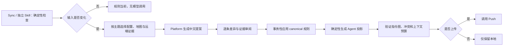

# 阶段 07：建立指令与规则治理模块

## 目标

把规则生成、审阅、应用、Agent 投影和持续更新收敛为一个独立的深模块。Sync 只检查规则状态并提供入口，Codebase Map 只提供项目事实，Platform 保存提案与历史证据，Push 负责远端同步。

本阶段不再新增一套平行 CLI。用户入口继续使用 `instructions`，并由独立的 `harness-instructions` Skill 编排：

```text
npx hunter-harness instructions inspect
npx hunter-harness instructions propose
npx hunter-harness instructions apply
npx hunter-harness instructions project
```

旧 `rules-sync` 只保留为兼容别名，并给出迁移提示。

## 依赖与并行边界

依赖阶段 01 的规则、指令和项目级候选 Schema。完整证据提案还依赖阶段 05 的 `MapEvidenceBundle` 和阶段 06A 的候选查询 Interface。

本阶段可分为两个工作包，其中 07A 内部的清单、Inspect 和各 Agent Adapter 可以并行：

1. **07A 清单、Inspect 与 Agent Adapter**：定义 `rules-manifest.json`、canonical 读取、哈希、新鲜度和冲突；Codex、Claude、Cursor、CodeBuddy 使用共享 fixture 并行实现，每个 Adapter 只拥有自己的目标路径。07A 可与阶段 05、06A 并行。
2. **07B 证据提案与应用**：等待 Map 和候选 Interface 冻结后实现 `propose()`、`apply()`，最后与 07A 汇合。

本阶段拥有 canonical 规则、提案生命周期和 Agent 投影，不拥有 Map 生成、归档提取、Sync 编排或 Push。Sync 只调用 Interface，Plan 只写阶段 01 定义的候选。

### 与 Sync 的 Provider Interface

阶段 07 向阶段 04 提供薄 Adapter，规则治理的 Implementation 仍保留在 `InstructionGovernanceModule`：

```text
inspectInstructions(input: InstructionInspectionInput) -> InstructionHealth
planInstructionActions(inspectionRef, findingIds) -> InstructionActionPlan
verifyInstructionReceipt(receipt) -> InstructionVerification
```

`InstructionInspectionInput` 是阶段 07 拥有的最小输入 Interface，包含项目身份、启用 Agent、canonical 与投影路径、Map 证据引用、归档证据游标和提示词版本。阶段 04 的 Adapter 负责从 `SyncContext` 映射该输入；阶段 07 不依赖 Sync 的内部类型。`inspectionRef` 包含输入指纹、canonical 基线哈希和 Inspect 结果哈希，后续计划不能重新推断另一份输入。

`inspectInstructions()` 必须是确定性只读操作，不调用模型。它返回 canonical 和投影哈希、输入指纹、结构问题、内容质量建议、上次提案与应用基线，以及本次是否确实需要重新审计。

```text
InstructionHealth = {
  schema_version,
  inspection_id,
  input_fingerprint,
  canonical_hash,
  projection_hashes,
  status,
  structure_findings[],
  quality_suggestions[],
  last_proposal_ref?,
  last_apply_receipt_ref?,
  requires_reinspection
}
```

- 入口缺失、引用无效、循环和投影冲突属于结构问题。
- architecture、testing、build 等主题不足属于内容质量建议，不能把结构完整的入口标成失败。
- 输入指纹未变化时返回当前状态，不生成固定 `INSTRUCTION_AUDIT_REQUIRED`。
- 只有用户选择「生成规则提案」后，才进入 `propose()` 和模型调用。
- `harness-sync` 与 `harness-instructions` Skill 都调用同一个 Core Interface。Sync 不启动嵌套 `npx`，Skill 也不复制规则判断逻辑。
- `instructions apply` 返回实际修改、验证结果和可上传范围，不在内部调用 Push。

## 当前实现结论

### Sync 现在不会直接生成或更新规则

当前 Sync 的规则组件固定返回 `ADVISORY / INSTRUCTION_AUDIT_REQUIRED`，提示运行：

```text
npx hunter-harness instructions audit --json
```

Sync 本身不修改 `AGENTS.md`、Agent 入口或 `.harness/rules/`。它也没有保存「上次审计输入指纹」，因此即使项目内容没有变化，每次 Sync 仍会提示审计。

实际写入分为两步：

1. `instructions audit` 收集本地证据并请求 Platform 生成提案，只把提案保存到 `.harness/state/local/instruction-proposals/`。
2. `instructions apply --proposal ... --yes` 校验基线哈希后，事务性修改项目文件。

当前 `instructions apply` 还会隐式调用 Push。这与阶段 03、阶段 04 的统一上传入口冲突，应改为应用完成后询问是否上传。

### Codebase Map 已传给服务端，但利用很浅

客户端会读取七份 Codebase Map 文档，拼接后发送给 Platform，最大可达 512 KiB。当前服务端主要从中挑选不超过 12 条疑似路径的短行，用于生成 `AGENTS.md` 的「仓库导航」。

因此，当前 Codebase Map：

- 会增加请求体和模型上下文。
- 会影响仓库导航。
- 不会系统地生成架构、编码、测试或运行规则。
- 不会按任务或规则主题选择必要文档。

阶段 05 完成后，应改为消费结构化摘要、文档哈希和按主题选择的证据，不再拼接全部地图。

### 当前只生成一个通用规则文件

Platform 当前始终提议：

- `AGENTS.md`
- `.harness/rules/project-guidance.md`

并按已启用 Agent 追加：

- `CLAUDE.md`
- `.cursor/rules/project-guidance.mdc`
- `CODEBUDDY.md`

`.harness/rules/project-guidance.md` 混合了架构、接口、测试和项目特定规则。它不是按代码规范、架构、测试、提交、运行等方向拆分的多文件规则集。

仓库中另有一套 `project-rules` 投影逻辑，已经支持 `.harness/rules/` 下任意多个 `.md` 或 `.mdc` 文件，并能投影到 Claude、Cursor 和 CodeBuddy 目录。该逻辑主要在 Update 后执行，与服务端提案没有形成统一流程。

### 当前格式是固定模板，不是稳定协议

服务端写死了主要标题：

- `AGENTS.md`：项目概览、仓库导航、常用命令、工作约束、项目类型约束、验证要求、安全与提交、文档与规则演进、项目特定约定。
- `project-guidance.md`：适用原则、架构与接口、测试与质量、项目特定规则。

这些标题便于阅读，但没有独立的机器清单描述规则 ID、适用路径、激活方式、来源证据、版本、状态和上次审阅时间。持续更新只能依赖整文件哈希和文本比较，难以稳定做逐条提案、废弃和冲突分析。

### Agent 文件目前采用混合策略

当前不是全部指向同一文件，也不是全部保存完全一致的副本：

| Agent | 当前方式 | 问题 |
|---|---|---|
| Codex | `AGENTS.md` 中列出 canonical 规则路径 | Codex 只会自动加载目录链上的 `AGENTS.md`；普通路径说明不等于自动导入规则正文 |
| Claude Code | `CLAUDE.md` 使用 `@AGENTS.md` 和 `@.harness/rules/project-guidance.md` | `@` 导入可靠，但会在启动时加载全部导入内容，无法节省上下文 |
| Cursor | 生成 `.cursor/rules/project-guidance.mdc` | 使用原生格式，但当前 `alwaysApply: true`，所有会话都会加载通用大文件 |
| CodeBuddy | `CODEBUDDY.md` 提示遵循 AGENTS 和 canonical 规则；另有规则目录投影 | 入口与投影存在两套表达，容易漂移 |

结论是：不能只生成一个普通 Markdown 路径并假设所有 Agent 都会自动读取，也不应维护多份可独立编辑的全文副本。

## 官方机制带来的约束

调研日期：2026-08-12。

- [OpenAI Codex 的 AGENTS.md 文档](https://learn.chatgpt.com/docs/agent-configuration/agents-md)说明，Codex 按项目根到当前目录加载 `AGENTS.md` 或 `AGENTS.override.md`，默认合并上限为 32 KiB；普通 Markdown 链接不会成为新的自动指令源。
- [Claude Code 的项目记忆文档](https://code.claude.com/docs/en/memory)建议 `CLAUDE.md` 保持具体、简短和结构化，目标控制在 200 行以内；路径相关内容放入 `.claude/rules/`，多步骤流程或按需资料放入 Skill。Claude 官方也明确建议用 `@AGENTS.md` 共享通用规则，而不是复制一份。
- [Cursor Rules 文档](https://cursor.com/docs/rules)支持 `alwaysApply`、路径匹配、按描述智能加载和手动加载。`.cursor/rules/` 必须使用带 frontmatter 的 `.mdc`，普通 `.md` 不会被当作 Project Rule。
- [GitHub Copilot 自定义指令文档](https://docs.github.com/en/copilot/how-tos/configure-custom-instructions-in-your-ide/add-repository-instructions-in-your-ide)同样区分仓库级指令与路径级指令，路径级文件使用 `applyTo` glob；官方建议始终加载的指令保持简短、自包含并对多数任务有效。
- [AGENTS.md 规范](https://agents.md/)没有要求固定标题或字段，推荐记录项目概览、构建测试命令、代码风格和安全注意事项，并允许在大型仓库中使用嵌套 `AGENTS.md`。

这些机制共同说明：通用规则应少而稳定，范围规则应按路径或任务加载，强制约束应进入 lint、测试、Hook 或权限系统，而不是只写自然语言。

## 设计结论

### 建立一个深模块，而不是继续堆命令

模块（Module）命名为 `InstructionGovernanceModule`。它的接口（Interface）保持很小：

```text
inspect(input: InstructionInspectionInput) -> InstructionHealth
propose(inspectionRef, scope?) -> InstructionProposal
apply(proposalId, selections, expectedBaselineHash) -> InstructionApplyReceipt
project(canonicalRef, agents, expectedProjectionHashes) -> InstructionProjectionReceipt
```

Interface 还必须明确：

- `inspect()` 只消费已经构造的类型化输入，不访问网络、不调用模型，也不重新扫描 `SyncContext` 已提供的项目证据。
- `propose()` 只消费仍有效的 `inspectionRef`，返回带输入指纹、基线哈希和提案哈希的提案；输入变化时要求重新 Inspect，不静默重扫。
- `apply()` 先生成并验证投影计划，再在一个受保护事务中写 canonical 规则和无冲突的 Agent 投影；任何必需投影失败时回滚本次写入。
- `project()` 是可独立调用的确定性 Adapter，用于初始化、Refresh 或投影恢复，不更改 canonical 内容。
- 任一步骤失败都不能隐式 Push。

实现（Implementation）隐藏以下复杂度：

- 证据选择和输入指纹。
- Codebase Map 主题路由。
- Platform 近期归档证据。
- 规则去重、冲突和生命周期。
- 中文提案和逐条差异。
- 事务性应用和 Agent 原生投影。
- 指令图、上下文预算和宿主兼容校验。

模块的深度（Depth）来自「四个稳定接口覆盖完整规则生命周期」。Sync、Skill、Update 和初始化流程都只调用该接口，不再各自解析规则文件。

### 单独提供 `harness-instructions` Skill

建议独立 Skill，但不让 Sync 静默执行它：

- Sync 调用 `inspect()`，只显示「当前、需要复查、有候选、存在冲突」等确定性状态。
- 用户勾选「优化项目指令」后，Sync 进入 `harness-instructions` 的提案流程。
- 用户也可随时单独运行 Skill，按主题只检查架构、编码、测试或工作流规则。
- Skill 不包含远端上传实现。应用完成后统一询问是否调用 Push。

这样形成清晰的缝（Seam）：Sync 负责维护计划，Instruction Governance 负责规则质量，Push 负责数据移动。

## 目标文件模型

### 有界多文件，而不是单个大文件或无限拆分

canonical 真相源保存在 `.harness/rules/`：

```text
.harness/rules/
  core.md
  architecture.md
  coding.md
  testing.md
  workflow.md
  security.md              # 只有项目确有需要时生成
  rules-manifest.json
```

建议职责：

| 文件 | 内容 | 默认激活方式 |
|---|---|---|
| `core.md` | 全项目始终适用、不可从工具配置直接推导的少量约束 | 始终加载 |
| `architecture.md` | 需要 Agent 遵循的模块边界、依赖方向和接口不变量 | 按相关目录或任务加载 |
| `coding.md` | 命名、语言和框架约定；可由格式化工具强制的内容只保留工具入口 | 按语言或目录加载 |
| `testing.md` | 测试层级、文件位置、必要验证和已知环境限制 | 修改测试或产品代码时加载 |
| `workflow.md` | 安装、构建、运行、提交、评审和发布入口 | 按任务或手动加载 |
| `security.md` | 项目特有的数据边界和敏感操作；通用安全口号不写入 | 按敏感路径或任务加载 |

不要求每个项目都生成全部文件。小项目可以只有 `core.md`、`testing.md` 和 `workflow.md`；大型单体仓库优先使用路径作用域和嵌套入口，不按每条规则新建文件。

`architecture.md` 不复制 Codebase Map 的目录、调用链或现状说明。只有经过审阅且仍需约束未来修改的内容才进入规则；设计取舍的完整背景保留在来源 Change 或 ADR 中。

### 人类规则与机器元数据分离

Markdown 文件只保留 Agent 真正需要的短指令。`rules-manifest.json` 保存：

- `schema_version`、规则集版本和生成器版本。
- 文件主题、状态、内容哈希和上下文预算。
- `activation`：始终、路径、相关性或手动。
- `globs`、适用模块和目标 Agent。
- Codebase Map 版本与证据路径。
- 相关配置哈希和远端归档证据游标。
- 提案 ID、上次审阅时间、废弃状态和替代规则。

不把长证据、模型解释、时间戳和内部 ID 塞进始终加载的规则正文。

`RulesManifest` 的最小机器结构如下，字段使用阶段 01 规定的 `snake_case`：

```text
RulesManifest = {
  schema_version,
  ruleset_version,
  generator: { name, version, prompt_version? },
  project_identity,
  canonical_root,
  files: [{
    path,
    topic,
    status,
    content_hash,
    activation,
    globs[],
    module_refs[],
    target_agents[],
    context_budget,
    evidence_refs[]
  }],
  map_manifest_hash?,
  archive_evidence_cursor?,
  proposal_id?,
  reviewed_at?,
  supersedes?
}

activation = always | path | relevance | manual
rule status = active | proposed | deprecated | superseded | conflicted
```

`RulesManifest` 只保存引用和哈希，不内嵌 Codebase Map、归档摘要或模型解释。兼容 Adapter 可以读取旧清单，但新写入只使用当前 Schema。

### 规则正文使用固定的轻量结构

每个规则文档最多使用以下结构：

```markdown
# 测试规则

## 适用范围

## 必须遵循

## 禁止事项

## 验证方式

## 例外
```

- 指令必须具体、可验证，并说明适用范围。
- 没有禁止事项或例外时省略对应章节。
- 工具可以强制的格式、类型、安全和提交规则进入配置、测试或 Hook；文档只说明入口和项目特有原因。
- 观察到的代码习惯先作为候选，不直接升级为权威规则。

## Codebase Map 如何参与规则生成

Codebase Map 应参与，但只能作为项目事实证据：

| Codebase Map 文档 | 可支持的规则主题 | 禁止的推断 |
|---|---|---|
| `ARCHITECTURE.md` | 模块边界、依赖方向、数据流 | 仅因当前代码这样写，就宣称永远禁止其他结构 |
| `STRUCTURE.md` | 路径作用域、嵌套入口位置 | 把全部目录清单写进始终加载规则 |
| `CONVENTIONS.md` | 编码候选和命名候选 | 未经审阅直接成为治理规则 |
| `TESTING.md` | 测试命令、层级、目录和环境限制 | 把一次测试失败固化为长期规则 |
| `STACK.md` | 工具链、语言和包管理器入口 | 复制依赖清单或可从配置直接读取的信息 |
| `INTEGRATIONS.md` | 外部边界和必要验证 | 把地址、凭据或环境值写入规则 |
| `CONCERNS.md` | 需要复查的规则候选 | 自动生成禁止项 |

规则提案只读取本次主题需要的地图摘要和证据片段。`rules-manifest.json` 记录 `map-manifest.json` 版本和所用文档哈希，以便精确判断是否需要重审。

## 持续迭代模型

### 输入指纹

`inspect()` 不调用模型。它比较：

- canonical 规则和 Agent 投影哈希。
- Codebase Map manifest、相关文档哈希和源提交。
- 包清单、测试配置、CI 和构建配置的相关哈希。
- Platform 最近一次已消费的归档总结游标。
- 提取器、公共最佳实践基线和提示词版本。

输入没有变化时返回 `current`，Sync 不再重复提示审计。

### 候选来源

规则候选按可信度分层：

1. 用户明确确认的项目约束。
2. 项目配置、CI 和测试能直接证明的事实。
3. Codebase Map 中带路径证据的稳定事实。
4. Platform 中多次归档重复出现的决策、评审和失败模式。
5. 单次观察或模型建议。

只有前两类可以生成高置信度修改建议；第三、第四类需要差异预览和人工批准；第五类只进入待审候选。

本地扫描 `.harness/archive` 生成候选的旧逻辑应退役。归档证据已由 Platform 持久化，应由服务端按项目、版本和去重规则提供。

候选类型按以下方式处理：

- `rule`：可以进入规则提案。
- `architecture-decision`：只有其中可执行、长期有效的约束进入 `architecture.md`；完整决策仍保留在 Change/ADR。
- `glossary`：只在变更记录展示来源和待审状态，不写入规则，也不自动生成项目文件。
- Codebase Map 的单次观察：只能成为低置信度候选。

### 提案与应用

提案以文件和规则条目为单位展示：

- 新增、修改、移动、废弃。
- 修改前后差异。
- 来源证据和置信度。
- 为什么需要更新。
- 预计影响的 Agent 与上下文成本。
- 可自动应用、需要确认或只建议。

用户可逐条选择。应用必须校验基线和提案哈希，先完成投影冲突预检，再事务性写入 canonical 文件与无冲突投影、验证指令图并保存回执。应用成功后保留已处理建议及其结果，不把建议列表直接清空。

```text
InstructionProposal = {
  schema_version,
  proposal_id,
  inspection_ref,
  input_fingerprint,
  expected_baseline_hash,
  proposal_hash,
  actions[],
  evidence_refs[],
  status,
  created_at,
  expires_at
}

InstructionApplyReceipt = {
  schema_version,
  proposal_id,
  proposal_hash,
  applied_action_ids[],
  skipped_action_ids[],
  changed_paths[],
  canonical_hash,
  projection_receipt_ref,
  verification,
  rollback_ref?,
  completed_at
}
```

## Agent 投影策略

`.harness/rules/` 是唯一可编辑真相源。Agent 文件是 Adapter 产物，保证语义一致，不要求字节一致。

| Agent | 建议投影 |
|---|---|
| Codex | 根 `AGENTS.md` 内联精简 `core`、项目命令和导航；目录专属规则生成嵌套 `AGENTS.md`。不依赖普通链接自动加载正文 |
| Claude Code | `CLAUDE.md` 只 `@AGENTS.md` 并保留少量 Claude 专属约定；范围规则生成 `.claude/rules/*.md`，使用 `paths` frontmatter |
| Cursor | 通用内容可复用根 `AGENTS.md`；范围规则生成 `.cursor/rules/*.mdc`，按 `globs` 或 `description` 激活，不默认全部 `alwaysApply` |
| CodeBuddy | 生成最小 `CODEBUDDY.md` 和宿主支持的范围规则文件；正文来自 canonical 渲染，不形成第二真相源 |

生成投影时：

- 保存 canonical 哈希、投影哈希和 Adapter 版本。
- 投影未被修改时可安全刷新。
- 投影被本地修改时保留文件并报告冲突，提供「提升为 canonical 候选、恢复生成版本、保持本地」选项。
- Agent 专属规则保留在专属区，不反向污染所有 Agent 的通用规则。

## 目标流程



## 分步实施

本阶段按以下顺序实施，每一步形成独立提交和聚焦测试：

1. **07.1 统一术语与清单协议**：定义 canonical、投影、候选、提案、状态和 `rules-manifest.json`。
2. **07.2 抽取深模块**：让 Sync、Update、初始化和 `instructions` 共用 `InstructionGovernanceModule`。
3. **07.3 确定性 Inspect**：实现输入指纹、新鲜度、冲突和上下文预算，停止 Sync 固定告警。
4. **07.4 结构化证据选择**：按主题消费 Codebase Map、配置和 Platform 归档证据，移除 512 KiB 全量拼接。
5. **07.5 多文件提案协议**：生成有界规则集、逐条差异、证据和生命周期状态。
6. **07.6 Agent Adapter**：实现 Codex、Claude、Cursor、CodeBuddy 的宿主原生投影与冲突恢复。
7. **07.7 Skill 与交互**：增加独立 `harness-instructions` Skill，Sync 只提供入口；应用后统一询问 Push。
8. **07.8 迁移**：拆分旧 `project-guidance.md`，退役本地 archive 候选扫描和旧 `rules-sync` 写法。

## 验收条件

- 无相关输入变化时，Sync 不提示规则优化，也不调用模型。
- Codebase Map 只按主题提供有版本和路径证据的片段，不发送全部七份正文。
- 小项目不会被强制生成六份文件；大项目不会继续堆进一个通用大文件。
- `AGENTS.md`、`CLAUDE.md`、Cursor 和 CodeBuddy 投影符合各宿主的实际加载机制。
- canonical 规则只有一份可编辑真相源；投影冲突不会被静默覆盖。
- 规则提案可逐条接受、拒绝或保留，应用后仍可追溯修改前后和证据。
- 一次应用只复查受影响主题和投影，不重新运行全部 Sync 或 Codebase Map。
- 工具可强制的约束不会只依赖自然语言规则。
- `instructions apply` 不再隐式上传；只有用户确认后才调用 Push。
- 中文提案、CLI、Platform 页面和实际文件状态使用相同术语。
- Sync 的规则状态来自 `InstructionHealth`，不会每次固定提示审计，也不会把内容建议混入指令图结构失败。
- 独立 `harness-instructions` 与 Sync 使用相同输入指纹、基线和收据；同一输入不会产生两份不同提案。
- 应用规则后只验证受影响的 canonical 文件和 Agent 投影，并把实际可上传范围交回 Sync。

## 非目标

- 不让规则模块替代 lint、测试、权限、Hook 或 CI。
- 不把 Codebase Map 的观察结果自动升级为治理规则。
- 不把 Skill 内容、项目知识、设计和计划文档混入始终加载规则。
- 不要求所有 Agent 的文件字节一致，只要求来源唯一、语义一致和可验证。

## 实施记录

### 07A-M1：清单、确定性 Inspect 与 Agent 投影 Module

状态：已关闭。当前产物保留在 Hunter Harness 本地工作区，未提交、推送、合并或发布。

已冻结的 v1 Interface：

- `readRulesManifest(input)` 严格读取 current `rules-manifest.json`，并保守投影 legacy 清单。legacy 缺失的生成器、项目身份和文件元数据保持不可用，不补造当前事实。
- `inspectInstructions(input)` 只消费类型化快照，确定性返回输入指纹、canonical 与投影哈希、结构问题、质量建议和 `inspection_ref`，不访问文件系统、网络或模型。
- `planAgentProjection(canonicalRef, requests, expectedProjectionHashes)` 为 Codex、Claude Code、Cursor 和 CodeBuddy 生成只读写入计划。任一必需投影的渲染、预算、路径、期望基线或共享路径冲突失败时，返回 `executable=false` 且 `operations=[]`。
- canonical 根固定为 `.harness/rules`。manifest 与 Inspect 的 canonical 文件集合必须精确一致；globs、引用和目标路径使用项目内安全边界，不能读取或投影阶段 01 排除的敏感路径。
- 投影按实际渲染后的 UTF-8 字节执行请求预算。Codex 另强制 32 KiB 上限，Claude Code 的 `CLAUDE.md` 另强制 200 行上限。根 `AGENTS.md` 的依赖引用包含所有实际影响正文和导航的 active canonical 文件。
- 投影文件保存 canonical 哈希、内容哈希、Adapter 版本和稳定来源集合；观察到的投影哈希与期望基线不一致时固定返回冲突，不覆盖本地修改。

完成证据：

- 聚焦测试：`17/17` 通过，无跳过。
- Core 全量测试：`50` 个文件、`666` 项测试通过，无跳过。
- Core 类型检查、构建、限定范围 ESLint、根级 ESLint 和 diff check 通过。
- 对抗矩阵覆盖 manifest 外 canonical snapshot、安全 glob、四个 Agent 的真实渲染预算、Codex 32 KiB、Claude Code 200 行以及共享根投影的依赖追踪。
- 最终独立复审为 Ready，Critical、Important 和 Minor 均为 `0`。
- 修改范围仅为新的 `packages/core/src/instruction-governance/**`、聚焦测试和 current/legacy fixture；未修改 CLI 注册、Skill、Sync、Update、初始化流程、现有 Agent 文件或 canonical 规则。

07A-M1 关闭后仍未接入的 Adapter：

- 07B 的 Map/Platform 候选证据选择、规则提案、逐条审阅、应用收据和候选生命周期。
- 真实文件系统事务、回滚、受影响指令图验证和投影冲突恢复操作。
- `instructions` CLI、`harness-instructions` Skill、旧 `rules-sync` 兼容别名及中文迁移提示。
- Sync、Update、初始化和阶段 04 Provider Adapter；这些调用方必须消费同一 `InstructionHealth` 与 `inspection_ref`，不能复制检查算法。
- Platform 提案、历史证据与页面接入，以及应用完成后交回阶段 03 Push 的显式上传选择。

### 07B-M1：证据提案与应用事务 Module

状态：已关闭。当前产物保留在 Hunter Harness 本地工作区，未提交、推送、合并或发布。

已冻结的 v1 Interface：

- `selectInstructionEvidence(...)` 从阶段 05 Map 片段和阶段 01 `ProjectContentCandidate` 选择有界、按主题、带版本与路径引用的证据。单次 Map 观察保持低置信，不拼接全部七份文档。
- `proposeInstructionChanges(...)` 绑定完整 `inspection_ref`、canonical baseline、证据哈希、模型和 prompt 身份、proposal hash 与 expiry。proposal 入口从 raw candidate、raw Map snippet 和 selection scope 重新构造证据，不信任调用方自声明派生字段或自哈希。
- `architecture-decision` 只有被 scope 明确标记为已确认、可执行时才能提案；`glossary` 永远为 `display_only`，不能形成文件写入。
- accept、reject、retain 三种选择保留逐条结果和证据。全 reject/retain 可生成零写入但可追踪的 receipt；任一 accepted action 的 baseline、expiry、CAS 或必需投影失败时，整个计划 `operations=[]` 并保留 rollback 计划。
- canonical 文档、`.harness/rules/rules-manifest.json` 和 Agent projection 位于同一事务。manifest 是严格、带内容、内容哈希和 expected hash 的真实 CAS write operation，参与操作顺序、rollback、transaction hash、changed paths 和 receipt。
- receipt 验证从可信 proposal、apply plan 和 execution evidence 重建完整预期 payload；修改 action outcomes、applied/skipped、paths、projection ref、verification、rollback 或完成身份后重新计算自哈希仍然无效。
- canonical 路径和敏感内容复用阶段 01 classifier 与共享 scanner；Module 不访问文件系统、Platform 或网络，不调用 Push。
- legacy proposal 只读归一化且永不进入 ready；新写入只使用 current v1。

完成证据：

- 聚焦测试：`13/13` 通过。
- 07A、阶段 05 与阶段 01 契约的受影响测试：`4` 个文件、`437/437` 通过。
- 稳定树 Core 全量测试：`54` 个文件、`764/764` 通过；后续整合门禁达到 `769/769`。
- Core 类型检查、构建、限定范围 ESLint 和 diff check 通过。
- hostile 矩阵覆盖自哈希 glossary evidence、八类 receipt 字段篡改、manifest 旁路、CAS/expiry/projection 失败和全 reject/retain 零写入。
- 最终独立复审为 Ready，Critical、Important 和 Minor 均为 `0`。
- 修改范围仅为新的 `packages/core/src/instruction-proposal/**`、聚焦测试和 current/legacy fixture；未修改 07A、共享契约、CLI、Skill、Sync 或 Platform。

07B-M1 关闭后仍未接入的 Adapter：

- Platform 候选查询、模型调用、proposal 持久化与候选状态 Adapter；本地 Module 只接受已冻结 wire 和注入 Port。
- 真实文件系统事务、受保护写入、rollback 执行、受影响指令图验证和 receipt 持久化。
- `instructions propose/apply` CLI、`harness-instructions` Skill、中文逐条审阅和旧 `rules-sync` 迁移。
- 阶段 04B `SyncActionProvider`、初始化与 Update Adapter，以及应用完成后交回阶段 03 Push 的一次显式选择。

### 07B-M2：Current InstructionProposal 可信验证 Module

状态：已关闭。当前产物保留在 Hunter Harness 本地工作区，未提交、推送、合并或发布。

已冻结的 v1 Interface：

- `verifyCurrentInstructionProposal(proposal_json, trusted_json)` 是 current proposal 的唯一可信验证入口。公开边界只接受各自不超过 1 MiB 的 JSON string；对象、Proxy 或 getter 在任何反射前拒绝，trap 调用为零。
- trusted 输入显式包含 raw Map snippets、阶段 01 raw candidates、selection scope、inspection/baseline/canonical identities、时间与模型 metadata，以及持久化的 `raw_model_actions`。待验 `proposal.actions` 不能充当模型语义真相源。
- proposer 与 verifier 共用同一私有 builder：先从 raw Map/candidate/scope 重建唯一 EvidenceBundle，再用 trusted raw actions 与 metadata 生成唯一 expected proposal，最后对待验 proposal 做 stable exact 比较。
- trusted 顶层、inspection、Map/snippet/budget、scope、candidate/provenance 与 raw action 均使用 exact runtime schema。未知字段、nested extra、cycle、accessor、symbol 或资源预算超限 fail closed；snapshot 使用 null-prototype 记录。
- invented evidence、错误资格/topic、glossary 可执行化、未确认 architecture、absolute/noncanonical path、move/source、baseline/content/action/proposal/evidence identity 和敏感内容均由 07B 现有重建与共享 scanner 验证，不由 Adapter 复制。
- 同一 trusted actions 下修改 proposal 内容并自重哈希固定 mismatch；trusted actions 自身包含密码等敏感内容或未知字段固定 invalid。
- 时间严格满足 `created_at <= verified_at < expires_at` 且使用 RFC3339；legacy proposal 只读 fail closed。验证成功返回 frozen verified proposal 与重建 evidence。

完成证据：

- 聚焦测试：`27/27` 通过。
- 07A、04B、scanner 与契约受影响测试：`6` 个文件、`455/455` 通过。
- 稳定共享 Core 全量测试：`62` 个文件、`952/952` 通过。
- Root 类型检查、Core/Contracts 构建、限定范围 ESLint 和 diff check 通过。
- hostile 矩阵覆盖 Proxy 零 trap、trusted/raw nested extra、invented evidence、Delete-all-tests 自重哈希、敏感 pinned action、资格/路径/身份/时间和 legacy。
- 最终独立复审为 Ready，Critical、Important 和 Minor 均为 `0`。
- 修改范围仅为 `packages/core/src/instruction-proposal/**` 与其聚焦测试；proposal wire 未改变，未修改 04B Provider、07A、scanner、barrel、CLI、Skill、OpenAPI 或 Platform。

07B-M2 关闭后仍未接入的 Adapter：

- 04B-2 Instruction Provider 必须序列化 untrusted proposal 与 trusted raw inputs并只消费本 verifier；不得保留第二套 proposal/action/evidence 规则。
- 模型 raw action、trusted evidence snapshot 和 verifier receipt 的真实持久化 Adapter。
- 07B-M1 已记录的文件系统事务、CLI/Skill、候选生命周期、Platform 和 Push 接线。
